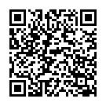
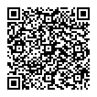

# New Volunteer Checklist

## Things Everyone Needs

* Attitude check: [Code of Conduct](https://docs.seattlecommunitynetwork.org/community/code-of-conduct/) | [Privacy Policy](https://docs.google.com/document/u/3/d/e/2PACX-1vRCmtLW0hTsKQvG80XdqKVXWHwSV0Xpf_30gYraiwn72dOVgqpwF6KFl-H1eV8xqwOkAS3GrPe2cJCA/pub) | [Mission/Values](https://docs.seattlecommunitynetwork.org/community/mission-vision-values/)  
* Discord access: [Invite Link](https://discord.com/invite/gn4DKF83bP)  
* Projects calendar: [Google Calendar](https://calendar.google.com/calendar/u/0/embed?src=c_a1hc9up10c9k6a3g6f2om37g6o@group.calendar.google.com&ctz=America/Los_Angeles&pli=1)  
* Current best documentation: [MkDocs](https://docs.seattlecommunitynetwork.org/) | [GitHub](https://github.com/Local-Connectivity-Lab/scn-documentation) | WikiJS (in the works)  
* Volunteer Liability Waiver form: [CognitoForms](https://www.cognitoforms.com/TheSilentTaskForce1/SCNVolunteerReleaseAndWaiverOfLiabilityForm) | [Google Drive](https://drive.google.com/file/d/1g6VRdacJ_6ngWteV8VTyhJVMs4_aGcoa/view?usp=drive_link)

## Network and Org Administration

* Setup  
  * Google Drive access and permissions as needed  
  * GitHub access and permissions as needed  
  * Wireguard for VPN access: [Instructions](https://docs.google.com/document/d/1XYseq-wD6JHVQCVcFpiqd1OHlGJoyG0kH1GmyoofmKE/edit?usp=drive_link)  
  * Create an LDAP user object for the volunteer: [FreeIPA](https://ldap.cloud.seattlecommunitynetwork.org)  
* Management Environments  
  * Redmine for tickets and work orders: [Redmine](http://redmine.infra.seattlecommunitynetwork.org)  
  * Netbox for site asset management: [NetBox](https://netbox.seattlecommunitynetwork.org:8089/)  
  * LibreNMS for site monitoring: [LibreNMS](https://librenms.seattlecommunitynetwork.org)  
  * Proxmox for hosted services: Proxmox (link TBD)  
  * Vaultwarden for variety accounts, local controllers: [Vaultwarden](https://vaultwarden.seattlecommunitynetwork.org/)

## SCN Space Membership and Access

* SCN Space: [general information](https://docs.seattlecommunitynetwork.org/community/space/)  
* Read and agree to [SCN Space Membership Policies](https://docs.google.com/document/d/1jHKDoY01IUAhroEsmL_nff-2he1DZx-30uwkQw4jY6A/edit)  
* Fill out [Application](https://www.cognitoforms.com/TheSilentTaskForce1/SCNSpaceMembershipApplicationFormAndAgreement)

## Field Links

|  Volunteer Waiver Form |  Discord Invitation |
| :---: | :---: |
|  Projects Calendar |  Docs Site |
